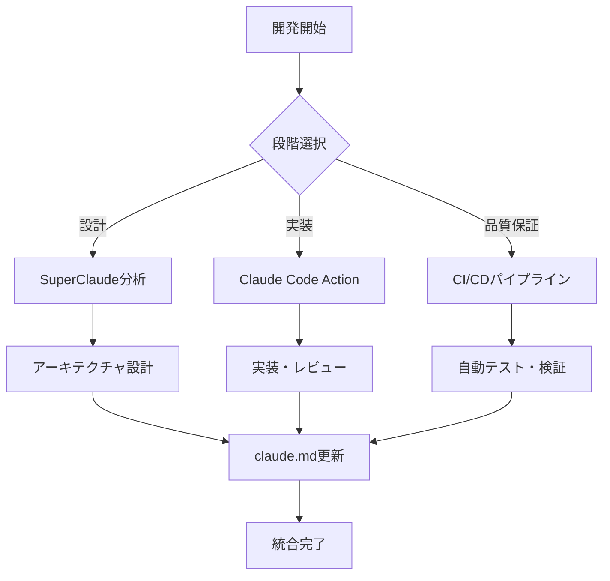

# SuperClaude統合設定（オプション）

このファイルは、SuperClaudeフレームワークとの統合用設定です。

## SuperClaude有効化手順

1. **SuperClaudeのインストール**
   ```bash
   # セットアップスクリプトを実行
   ./scripts/setup-integration.sh
   # または手動インストール
   curl -sSL https://raw.githubusercontent.com/SuperClaude/install.sh | bash
   ```

2. **プロジェクト固有設定**
   ```bash
   # このプロジェクト用の設定を適用
   claude config set project.name "$(basename "$(pwd)")"
   claude config set project.type "typescript"
   ```

## 統合フレームワーク設定

### コアフレームワーク
@../PRINCIPLES.md
@../RULES.md
@../FLAGS.md

### プロジェクト固有ルール

#### 開発ワークフロー
1. **分析フェーズ**: `/sc:analyze` でコードベース分析
2. **設計フェーズ**: SuperClaudeエージェントによる設計提案
3. **実装フェーズ**: Claude Code Actionとの連携
4. **品質保証**: CI/CDパイプラインによる自動検証

#### 使い分けルール
```markdown
## 開発段階別ツール使い分け

### 🎯 プロジェクト初期段階
- **SuperClaude**: `/sc:analyze --focus architecture`
- **用途**: 全体設計、技術選択の決定

### 🔨 実装段階
- **Claude Code Action**: GitHub PR/Issue上で `@claude`
- **用途**: コードレビュー、具体的な実装支援

### 🔍 品質保証段階
- **CI/CD Pipeline**: 自動実行
- **用途**: テスト、セキュリティ、パフォーマンス検証

### 📝 ドキュメント更新
- **claude.md**: 開発履歴・学習事項記録
- **SuperClaude**: 構造化ドキュメント生成
```

## エージェント活用指針

### システム設計時
```bash
claude --agent system-architect "新しい機能のアーキテクチャを設計"
```

### コード品質向上
```bash
claude --agent refactoring-expert "技術的負債の解消提案"
```

### セキュリティ強化
```bash
claude --agent security-engineer "セキュリティ脆弱性の分析"
```

### パフォーマンス最適化
```bash
claude --agent performance-engineer "ボトルネック分析と最適化案"
```

## 統合パイプライン



## カスタムコマンド例

### `/project-init` - プロジェクト初期化
```bash
# 新プロジェクト用の初期分析と設定
claude /sc:analyze --type structure --depth deep
claude /sc:design --persona system-architect
```

### `/quality-check` - 品質チェック
```bash
# 包括的な品質チェック
claude /sc:analyze --focus quality,security,performance
```

### `/deployment-prep` - デプロイ準備
```bash
# デプロイ前の最終チェック
claude /sc:validate --production-ready
```

## 高度な統合機能（オプション）

### 自動claude.md更新
SuperClaudeが開発進捗に応じてclaude.mdを自動更新

### GitHub Actions連携
CI/CDパイプラインの結果をSuperClaudeで分析・改善提案

### 学習機能
プロジェクト固有のパターンを学習し、最適化提案を改善

## 無効化方法

SuperClaudeが不要な場合：
1. このファイル（.claude/CLAUDE.md）を削除
2. `.claude`ディレクトリを削除
3. `claude.md`の既存機能は継続使用可能